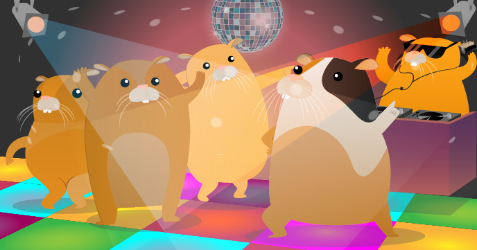

# Hamster Party Cam

> Hamsters are nocturnal, which means that they sleep in the daytime and come out at night. This means that when you are sleeping, your hamsters are up and about and when you are up and about, your hamsters are sleeping!
>
> ~ Violet

We need to find some way of being able to see what the hamsters are up to during the night. I suspect they are partying.

In this project, we are going to use a Raspberry Pi camera and an Explorer HAT with a Raspberry Pi to take pictures and video of the hamsters, triggered by their movement.

## Requirements

As well as a Raspberry Pi with an SD card loaded with Raspbian, you'll also need:

### Hardware

- 1 x [Raspberry Pi Camera Module](http://www.raspberrypi.org/product/camera-module/)
- 1 x Explorer HAT (e.g. from [Pimoroni](https://shop.pimoroni.com/products/explorer-hat))
- 2 x crocodile clip cables (e.g. from [Amazon](http://www.amazon.co.uk/20pcs-Double-ended-Crocodile-Alligator-Jumper/dp/B00K685PZ6/))
- 2 x male-to-male jumper wires (e.g. from [Pimoroni](http://shop.pimoroni.com/products/jumper-jerky))
- 1 x wind speed sensor (e.g from [Maplin](http://www.maplin.co.uk/p/maplin-replacement-wind-speed-sensor-for-n96fy-n82nf))
- 1 x speaker with 3.5mm audio jack (e.g from [Amazon](http://www.amazon.co.uk/XMI-X-Mini-Generation-Capsule-Speaker/dp/B001UEBN42))

### Software

- python3-picamera
- python3-explorerhat

See more information on checking you have these packages installed, and how to install them, on the [software installation](software.md) page.

### Extras

- 1 x hamster cage with hamster wheel
- 1 x hamster

## Steps

1. Setting up your Raspberry Pi, Pi Camera and Explorer HAT
1. Create a trigger switch
1. Create a Python program to take pictures of the hamsters
1. Get the party started with lights!
1. Hamsters need music to dance!

## Worksheet & included files

- [The worksheet](worksheet.md)
- (Optional) Final version of Python code [hamster-party.py](code/hamster-party.py)

## Disclaimer

Adding lights and music to the party is fun but it could keep *you* awake at night, and may become a little annoying to adults, so you might not want to keep your speaker turned on every night.

It may also scare hamsters of a shy disposition, and as a hamster owner you have a duty to care for the wellbeing of your hamster. [Check out the RSPCA Hamster Guide to learn more](http://www.rspca.org.uk/allaboutanimals/pets/rodents/hamsters)!

## Community

Based on an idea submitted for the Raspberry Pi Poster Competition in December 2013 by Violet.
It's been a pleasure to make this Raspberry Pi poster project idea a reality.

## Licence

Unless otherwise specified, everything in this repository is covered by the following licence:

***Hamster Party Cam*** by the [Raspberry Pi Foundation](http://www.raspberrypi.org) is licensed under a [Creative Commons Attribution 4.0 International Licence](http://creativecommons.org/licenses/by-sa/4.0/).

Based on a work at https://github.com/raspberrypilearning/hamster-party-cam
