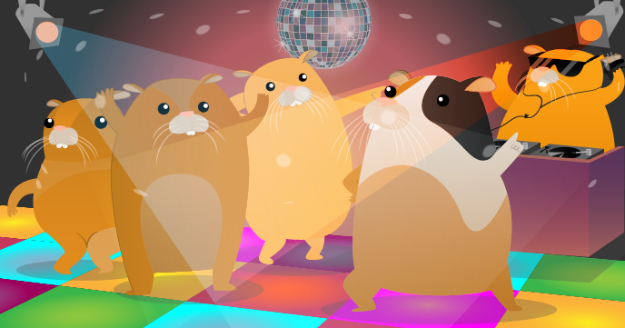
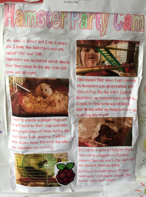

## Introduction

[[[camera-bullseye]]]

### What you will make

Have you ever wondered what your pet hamsters get up to during the night? I suspect they are partying!

In this project, you are going to use a Raspberry Pi Camera Module, some LEDs, and a reed switch to take pictures of your pet rodent whenever it uses its exercise wheel.

Adding lights and music to the party is fun, but it could keep you awake at night, and may become a little annoying to adults. Therefore, you might not want to keep your speaker turned on every night. It may also scare hamsters of a shy disposition, and as a hamster owner you have a duty to care for the wellbeing of your hamster. Check out the [RSPCA Hamster Guide](http://www.rspca.org.uk/allaboutanimals/pets/rodents/hamsters){:target="_blank"} to learn more!

This project is based on Violet's entry for the Raspberry Pi poster competition in December 2013. It has been a pleasure to make this project idea a reality.

_"Hamsters are nocturnal, which means that they sleep in the daytime and come out at night. So when you are sleeping, your hamsters are up and about, and when you are up and about, your hamsters are sleeping!"_  – Violet

### What you will learn

This resource covers elements from the following strands of the [Raspberry Pi Digital Making Curriculum](https://www.raspberrypi.org/curriculum/){:target="_blank"}:

- [Combine programming constructs to solve a problem](https://www.raspberrypi.org/curriculum/programming/builder){:target="_blank"}
- [Combine inputs and/or outputs to create projects or solve a problem](https://www.raspberrypi.org/curriculum/physical-computing/builder){:target="_blank"}
