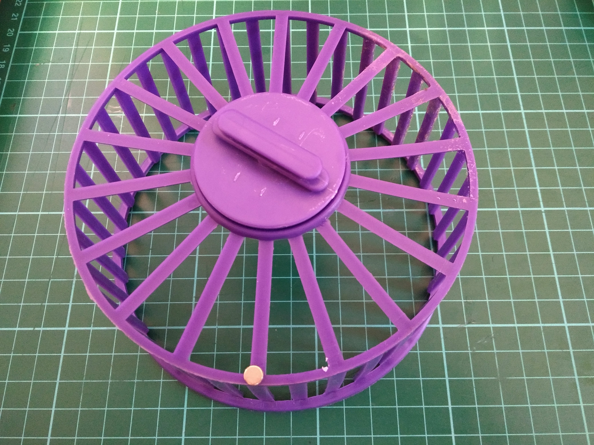
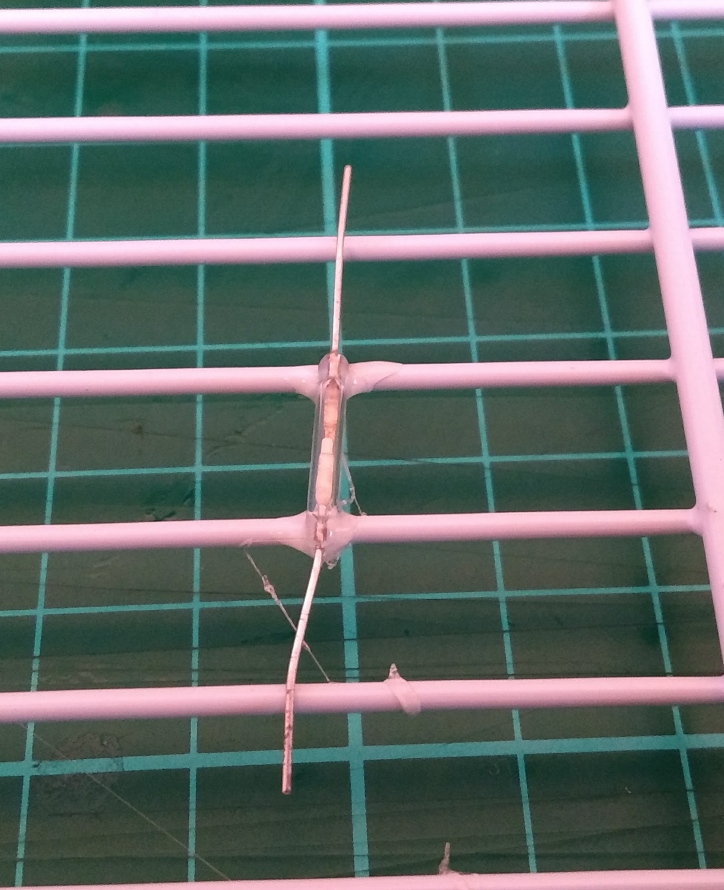
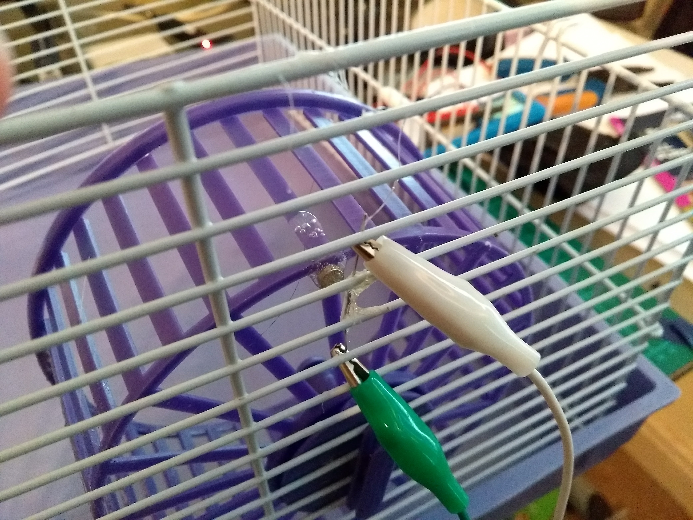
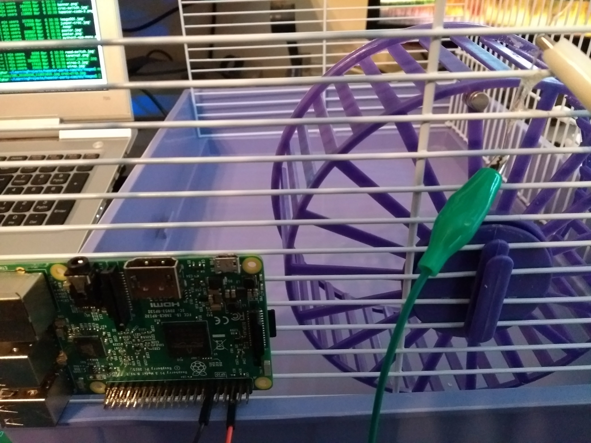
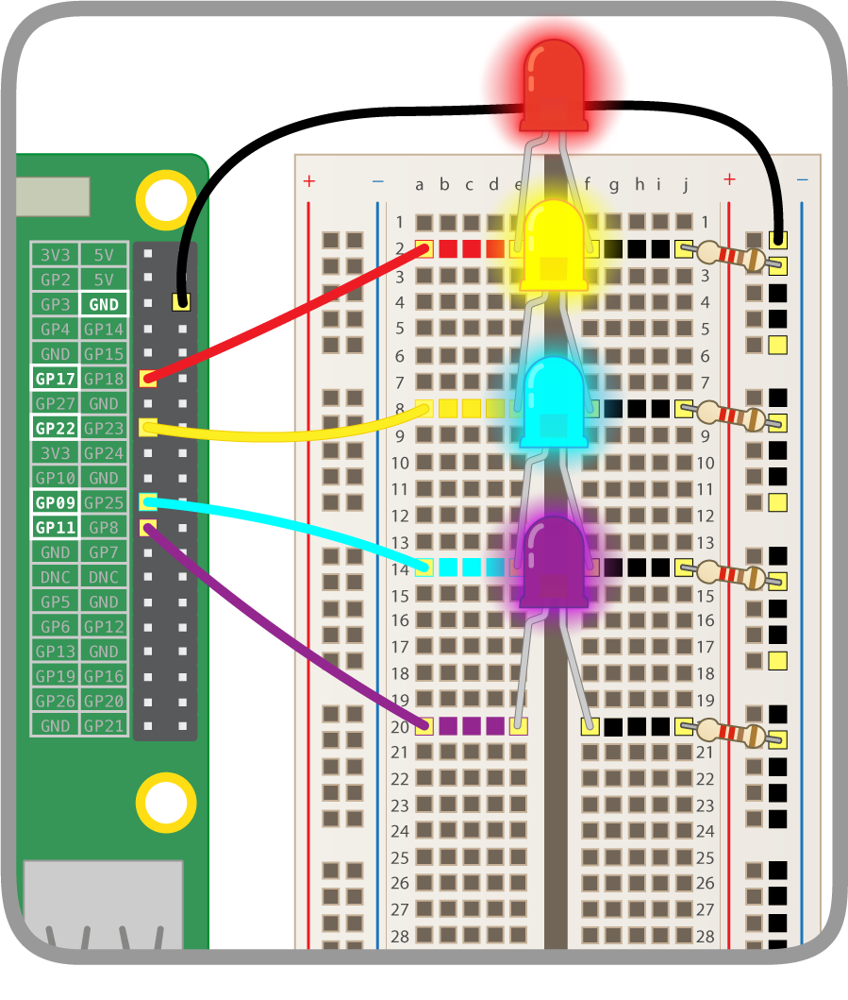

## Hardware setup

We only want the Raspberry Pi to take pictures of the hamsters when they are out having a good time. There's no doubt they are throwing down some robot dance moves in your absence! So you will need to create a way for the hamsters to trigger a program which takes a video of their party.

To do this, you're going to use a reed switch.

[[[generic-electronics-reed-switches]]]

- Remove the hamster wheel from the cage and place it on a table.

- Using a strong adhesive, glue the magnet to the rim of the hamster wheel and your reed switch to the side of the cage.

- Place the wheel back into the cage and then connect each end of the reed switch to a separate crocodile clip cable.

- Now use two female-to-male jumper leads to connect the reed switch to a ground (**GND**) pin and a numbered GPIO pin of your Raspberry Pi. Here it's on **GPIO 10**.

- Next you'll want to set up your LEDs. Each LED needs to be connected to a numbered GPIO pin, then to a resistor, and then to ground. If you are unsure how to connect up your LEDs, have a look at the collapsed section below.

[[[rpi-physical-connect-led]]]

With your LEDs wired up (here shown on pins **17**, **22**, **9**, and **11**), the final pieces of hardware to connect are your speakers and camera.

- Plug your speakers into your Raspberry Pi using the 3.5mm audio jack.

- Connect your Camera Module to your Raspberry Pi and point its lens towards the hamster cage.

[[[rpi-picamera-connect-camera]]]

You should have something that now looks a little like this:

