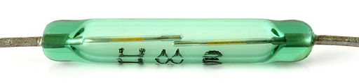
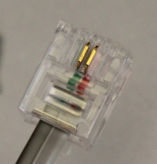
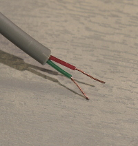
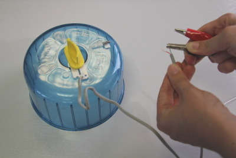
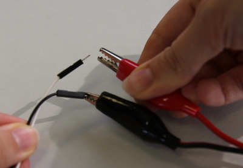

## Create a trigger switch

We only want the Raspberry Pi to take pictures of the hamsters when they are out having a good time. There's no doubt they are throwing out some robot dance moves in your absence! So you will need to create a way for the hamsters to trigger a program which takes pictures of their party.

- Remove the hamster wheel from the cage and place it on a table alongside the wind speed sensor. Unscrew the wind speed sensor's case, and remove the reed switch and the magnet. You may need to find an adult to help you with this.

    

    _By André Karwath aka Aka (Own work) [CC BY-SA 2.5](http://creativecommons.org/licenses/by-sa/2.5), via Wikimedia Commons_

- Using wire cutters, remove the RJ45 connector at the end of the reed switch to expose the two wires inside. These will be used to connect the reed switch to your Explorer HAT.

	 

- Using sticky back plastic, stick the reed switch to the centre of the hamster wheel and the magnet to the outer section of the wheel, so that it passes the reed switch when the wheel spins. Every time the magnet comes into contact with the reed switch, it will connect the wires inside.

- Connect each wire from the reed switch to a separate crocodile clip cable.

	

- Connect the other end of each crocodile cable to the end of a male-to-male jumper wire.

	

- Push the free end of one of the jumper wires into the socket labelled **Input 1** on your Explorer HAT, and the free end of the other jumper wire into the socket labelled **3V3**. It does not matter which way round the wires are, as long as they are both connected.
