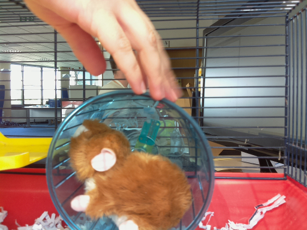

## Hamsters need music to dance

Finally, let's trigger some tunes for the hamsters to dance to by downloading a sound file like an `.mp3` or `.wav`, and playing it using **omxplayer**. You can use your own sound files if you transfer them to your Raspberry Pi - just change the name of the file in the code below.

- First, you will need to put a sound file onto your Raspberry Pi. You could create one in Sonic Pi, or you could add a sound file by transferring one from another computer via a USB memory stick. Make sure you save it into the `hamster` directory.

- Add two more lines below your other `import` statements:

	```python
	import os
	import sys
	```

- Find the line of code that says `disco()` add this code below it:

	```python
	os.system('omxplayer hamsterdance.mp3 &')
	```
	Note that you will need to replace the name of the `.mp3` file with the name of the file you are using if their names are not the same.

- Change your `sleep(0.2)` pause to be the same length as your tune. For example, my tune is ten seconds long, so I've changed it to `sleep(10)`.

- Save the file and test that the program works by triggering the switch again.

 Here is an example of an image taken by Hamster Party Cam:


