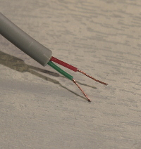
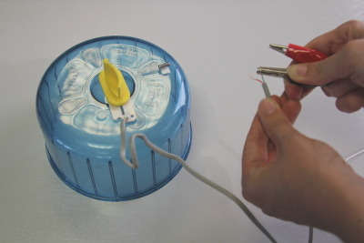
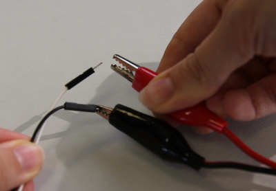

# Hamster Party Cam

In this project, we are going to use a Raspberry Pi camera and an Explorer HAT with a Raspberry Pi to take pictures and video of the hamsters, triggered by their movement. This will help us see what they are getting up to overnight!

## Set up hardware

If you haven't already done so, please see the [hardware information](hardware.md) page for instructions on setting up your camera module and Explorer HAT.

## Create a trigger switch

We only want the Raspberry Pi to take pictures of the hamsters when they are out and having a good time. No doubt they are throwing out some robot dance moves in your absence! So you will need to create a trigger to make a program run, in order to take pictures of the party.

1. Remove the hamster wheel from the cage and place it on a table alongside the [wind speed sensor](https://www.raspberrypi.org/learning/sensing-the-weather/guides/wind_speed/). You may need to locate an adult to help you unscrew the wind speed sensor case, and remove the [reed switch](http://upload.wikimedia.org/wikipedia/commons/b/bd/Reed_switch_%28aka%29.jpg) and the magnet.

1. Then, with some assistance, remove the RJ45 connector at the end of the reed switch to expose the two wires inside. These will be used to connect the reed switch to your Explorer HAT.

	 

1. Using sticky back plastic, stick the reed switch to the centre of the hamster wheel and the magnet to the outer section of the wheel, so that it rotates around and passes the reed switch. Every time the magnet comes into contact with the reed switch, it will connect the wires inside.

1. Next, connect the wires from the reed switch to separate crocodile clip cables.

	

1. Connect the other end of the crocodile cables to the end of two separate male-to-male jumper wires.

	

1. Push the other end of one of the male-to-male jumper wires into the socket labelled `Input 1` on your Explorer HAT, and the other into the socket labelled `3V3`. It does not matter which way round the wires are, as long as they are both connected.

## Create a Python program to take pictures of the hamsters

With a Camera Module connected and a trigger switch all set up with the Explorer HAT, you can now write a program in Python to detect movement and take a picture.

1. Open a terminal window.

1. Type `mkdir hamster`, and press **enter** to create a folder for your hamster party pictures.

1. Then, from the **Programming** menu, open **Python 3 (IDLE)**.

    

1. Click **File** > **New File** to create a blank file. Save your file into the `hamster` directory you just created and call it `hamster_party.py`.

1. Begin your code by importing the Explorer HAT Python library, the PiCamera library and the sleep function from the time library:

    ```python
		import explorerhat
		import picamera
		from time import sleep
    ```

1. Now add some code to take a photograph when the reed switch is triggered:

	```python
	def hamster_awake(input):
    with picamera.PiCamera() as camera:
			camera.resolution = (1024, 768)
			camera.capture('/home/pi/hamster/image.jpg')
			print("Party!")
			sleep(0.2)

	explorerhat.input.one.changed(hamster_awake)
	```

	Let's look at what this code does:
	- `def hamster_awake(input):` - define a function called `hamster_awake`
	- `with picamera.PiCamera() as camera:` and `camera.resolution = (1024, 768)` - set up the camera
	- `camera.capture('/home/pi/hamster/image.jpg')` - take a picture and save it as `image.jpg`
	- `sleep(0.2)`- wait 0.2 seconds between pictures
	- `explorerhat.input.one.changed(hamster_awake)` - when input 1 is activated, call the `hamster_awake` function

1. Save and run your code by pressing **F5**. Check that when you turn the wheel, a picture is taken and saved within the `hamster` directory. Can you spot a problem with this code? If your hamster moves around more than once, the picture overwrites each time.

1. We would like to be able to save lots of different hamster pictures, so let's add a variable so that we can save the pictures with an ever increasing number in the filename. We will create a variable called `pic` to do this:

	```python
	pic = 1

	def hamster_awake(input):
		global pic
		with picamera.PiCamera() as camera:
			camera.resolution = (1024, 768)
			camera.capture('/home/pi/hamster/image%03d.jpg' % pic)
			print("Party!")
			pic += 1
			sleep(0.2)
	```
	- `pic = 1` - initialises a counter variable with a starting value of 1
	- `global pic` - allows us to update the variable from inside the function (to add one after a photo is taken)
	- `%03d` and `% pic` (in the camera.capture function) tells Python to insert the value of `pic` instead of `%03d`
	- `pic += 1` - adds one to the counter

1. Save your work and then run the program again by pressing **F5**, moving the hamster wheel several times. To end the program press **CTRL** and **C** on the keyboard at the same time.
1. Look in the `hamster` folder and check that multiple images have been saved.

## Get the party started with lights!

We can add extra fun to the Python program that uses more features of the Explorer HAT. For example, why not trigger the lights to come on in disco mode when a hamster triggers the switch?

1. Make sure that `hamster_party.py` file is open using the Python 3 (IDLE) editor.
1. Add a line with the other `import` statements:

	```python
	import random
	```

1. Underneath the line `pic = 1`, add a list of the LED lights on the Explorer HAT like this:

	```python
	colours = [explorerhat.light.red, explorerhat.light.yellow, explorerhat.light.green, explorerhat.light.blue]
	```
1. Below the list, create a disco function by typing the following:

	```python
	def disco():
	    for i in range(25):
	        result = random.choice(colours)
	        result.on()
	        sleep(0.2)
	        result.off()
	 ```
1. Then find the line `print("Party!")` and add `disco()` underneath it to call the disco function.

1. Save and test your code. Your hamster wheel switch should now trigger some disco lights on the Explorer HAT. The hamsters will love that! You can see the code so far [here](code/hamster_disco.py)

## Hamsters need music to dance!

Finally, let's trigger some tunes for the hamsters to dance to by downloading a sound file like an `.mp3` or `.wav` and playing it using omxplayer. You can use your own sound files if you transfer them to your Raspberry Pi; just change the name of the file in the code.

1. First you will need to put a a sound file onto your Raspberry Pi. You could create one in Sonic Pi, or you could add a sound file by transferring a sound file from a computer with a USB memory stick. Make sure you save it into the `hamster` directory.

1. Add two more lines with your other import statements:

	```python
	import os
	import sys
	```

1. Now navigate to the line `disco()` and underneath add

	```python
	os.system('omxplayer hamsterdance.mp3 &')
	```
	*Note that you will need to replace the name of the mp3 with the name of the file you are using, if it is different from the one being used here.*

1. Change your `sleep(0.2)` pause to be the same length as your tune. For example, my tune is 10 seconds long so I've changed to `sleep(10)`.

1. Save the file and test that the program works by triggering the switch again.

## Final project code:

Your final project code should look something like this:

```python
import explorerhat
import picamera
from time import sleep
import random
import os
import sys

pic = 1
colours = [explorerhat.light.red, explorerhat.light.yellow, explorerhat.light.green, explorerhat.light.blue]

def disco():
    for i in range(25):
        result = random.choice(colours)
        result.on()
        sleep(0.2)
        result.off()

def hamster_awake(input):
    global pic
    with picamera.PiCamera() as camera:
        camera.resolution = (1024, 768)
        camera.capture('/home/pi/hamster/image%03d.jpg' % pic)
        print("Party!")
        disco()
        os.system('hamsterdance.mp3 &')
        pic += 1
        sleep(10)


explorerhat.input.one.changed(hamster_awake)
```

Run your code and let your hamster loose. When the program is triggered by the switch, the lights will go into disco mode on the Explorer HAT, you should hear a tune, and the camera will take a picture. After a while, check the images on your Raspberry Pi and you should see some photographs of your hamsters having a good time. Here is an example of an image taken by hamster party cam:


## What next?
- Can you add to this system to feed your hamster too, for example by opening a door using a servo?
- Can you record how many turns the hamster wheel makes, to find out how active your hamster is?
- Can you think of other practical applications for sensors that trigger events?
